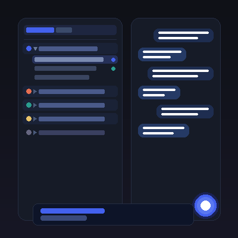

# Project Sidebar



A **frontend-only** Agent Zero plugin that replaces the default chats list with a **project-grouped sidebar view**. Chats are organized under collapsible project headers, sorted by most recently active chat.

## Features

- **Collapsible project groups** — Chats organized under their assigned project, collapsed by default
- **Smart sorting** — Project groups ordered by most recently active chat; chats within each group also sorted by recency
- **"No Project" group** — Chats without a project assignment are collected at the bottom
- **Edit shortcut** — Hover over any project header to reveal an edit icon linking to project settings
- **Persistent collapse state** — Expand/collapse preferences saved in `localStorage`
- **Status indicators** — Running (pulsing blue dot) and finished-unseen (teal dot) shown on collapsed project headers — matching the [Chat Status Marklet](https://github.com/mbradaschia/a0-chat-status-marklet) plugin visual style
- **Interoperability** — Maintains `.chat-container` class and adds `data-chat-id` / `data-project-name` attributes for other plugins (Chat Archive, Chat Rename, etc.)

## Installation

Install via the Agent Zero **Plugin Hub** (Settings → Plugins → Browse) or manually:

```bash
cp -r project_sidebar /path/to/agent-zero/usr/plugins/
```

Then enable the plugin in **Settings → Plugins**.

## How It Works

This is a **frontend-only plugin** — no backend changes needed. It reads existing chat context data (which already includes project assignment) from `$store.chats.contexts` and re-renders it grouped by project.

The default chats list is hidden via CSS. The project-grouped view is injected at the `sidebar-chats-list-start` extension point.

## Interoperability

Other plugins can target elements using these selectors:

| Selector | Description |
|---|---|
| `[data-project-name="project_name"]` | Project group container or chat item belonging to a project |
| `[data-chat-id="context_id"]` | Individual chat item |
| `.project-group` | Project group wrapper `<li>` |
| `.project-group-header` | Clickable project header (collapse toggle) |
| `.chat-container` | Individual chat row (same class as default sidebar) |
| `.chat-selected` | Currently selected chat |
| `.project-sidebar-list` | The grouped `<ul>` container |

## Chat Status Marklet Compatibility

This plugin integrates with the [Chat Status Marklet](https://github.com/mbradaschia/a0-chat-status-marklet) plugin:

- **Collapsed groups**: Shows aggregate running/unseen status dots on the project header
- **Expanded groups**: Individual per-chat marklet dots are shown (no duplication)
- The `chat_status_marklet` plugin's `_syncMarklets()` uses `data-chat-id` attribute matching for correct dot placement regardless of DOM ordering

## Version

1.0.0

## License

MIT — see [LICENSE](LICENSE)
